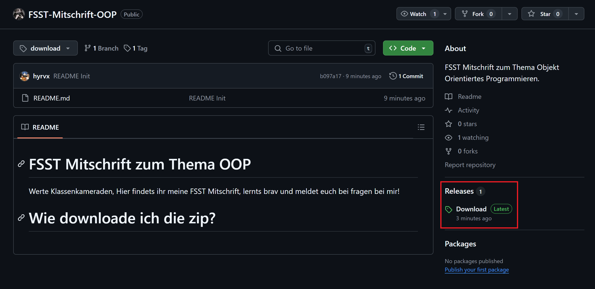
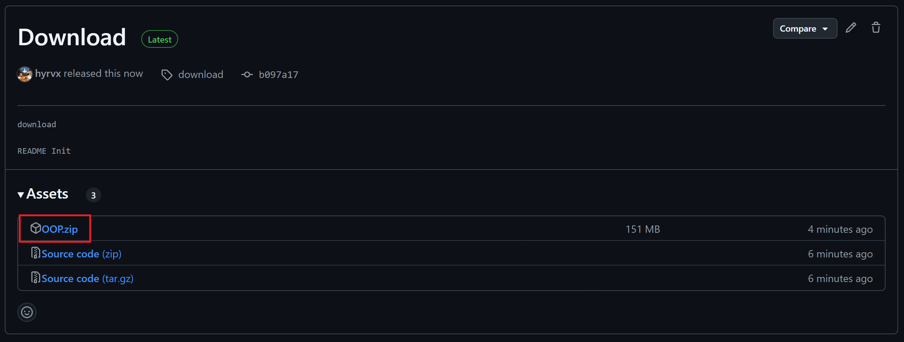

# FSST Mitschrift zum Thema OOP
Werte Klassenkameraden,  
Hier findets ihr einen erneuten Upload meiner FSST Mitschrift, da Google gewisse Dateien nicht im Drive haben will, und weitere Cloudspeicher anbieter womöglich auch nicht.   

Da die meisten von euch noch keine Erfahrung mit Github haben, gibts auch eine Anleitung zum herunterladen der ZIP. Bei fragen bitte melden!  

# Wie downloade ich die zip?
1. Finde auf der rechten Seite der Website den Tab "Releases" und clickt auf den Text "Download".

2. Von dort aus siehts ihr eine Liste von Dateien, clickt hier auf die Datei "OOP.zip".
Der Download sollte automatisch starten.

Ich wünsche viel erfolg beim lernen!  
Bin offen für Fragen, Wünsche und Seelenprobleme.

# Achtung ⚠️
Ich habe ein paar der Programme in Visual Studio Code geschrieben, was dazu führt, dass es schwieriger ist die Programme in Visual Studio zu compilieren und laufen zu lassen.  

Entweder ihr schaut die Programme nur an, oder Ihr probiert folgendes:
1. Öffne ein neues Visual Studio C++ Projekt
2. Erstelle die Dateien im Projekt neu **mit den selben Dateinamen**
3. Kopiere den Code in die jeweilige Datei
4. Eventuell müsst ihr die `#include "[...]"` Pfade anpassen

